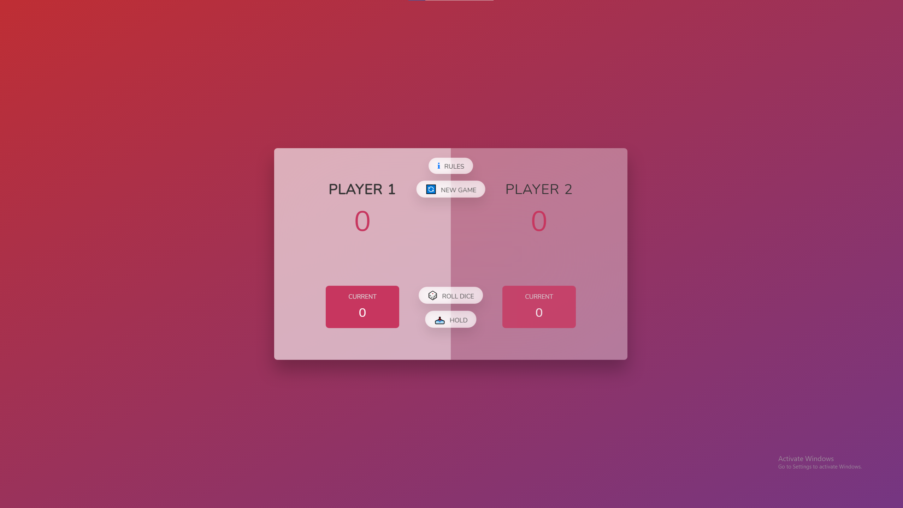
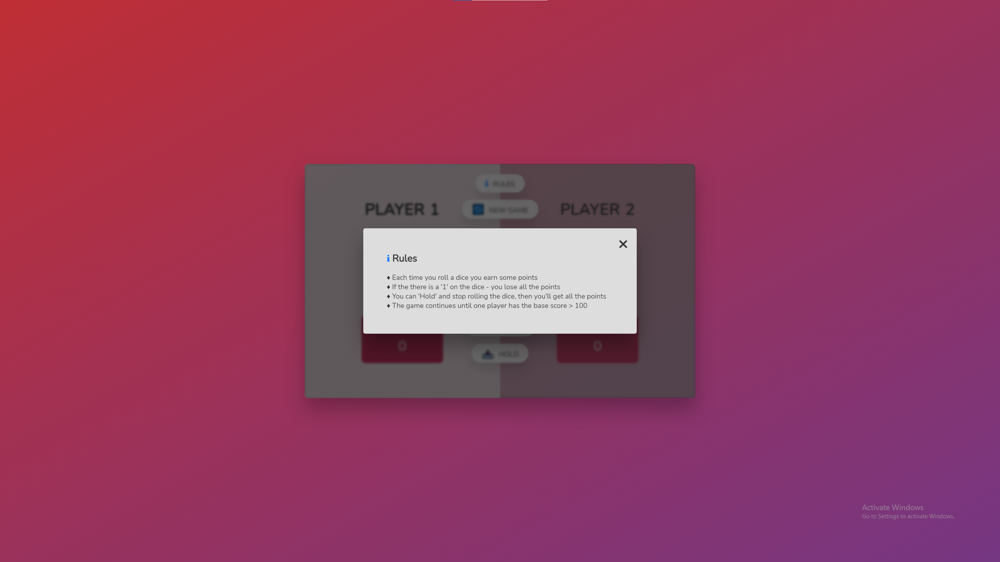
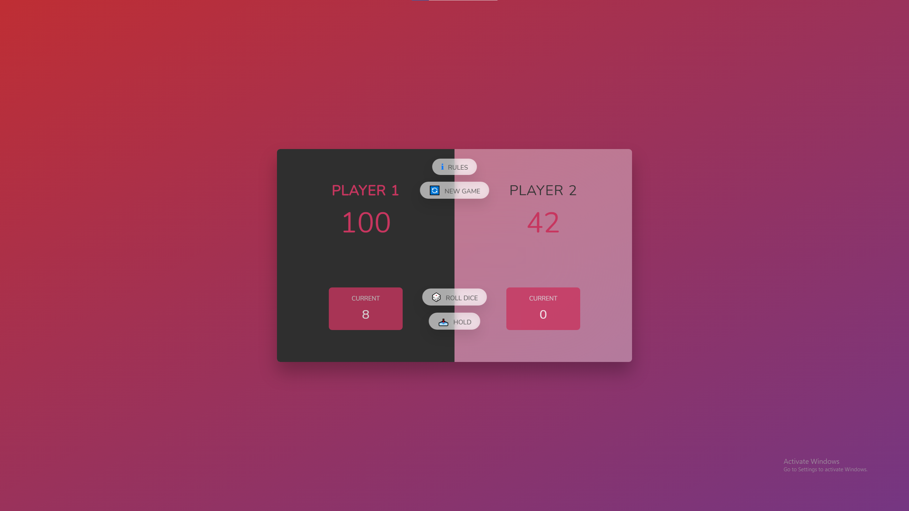

# Dice Game
Dice Game (Pig Game) - project from the Udemy course but with the reformatted code and new feature (rules of the game)

## Technologies:
- HTML
- CSS
- JavaScript

## Demo:
### Video-demo
https://youtu.be/gUOFO_-79Q8

### Images

1 - Main Screen

2 - Rules

3 - Winning Screen

